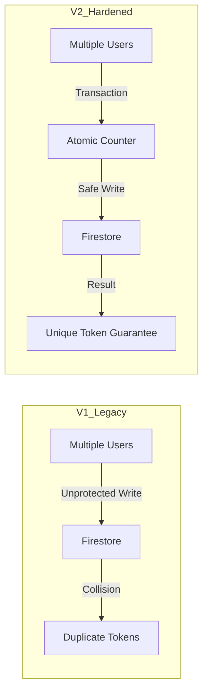
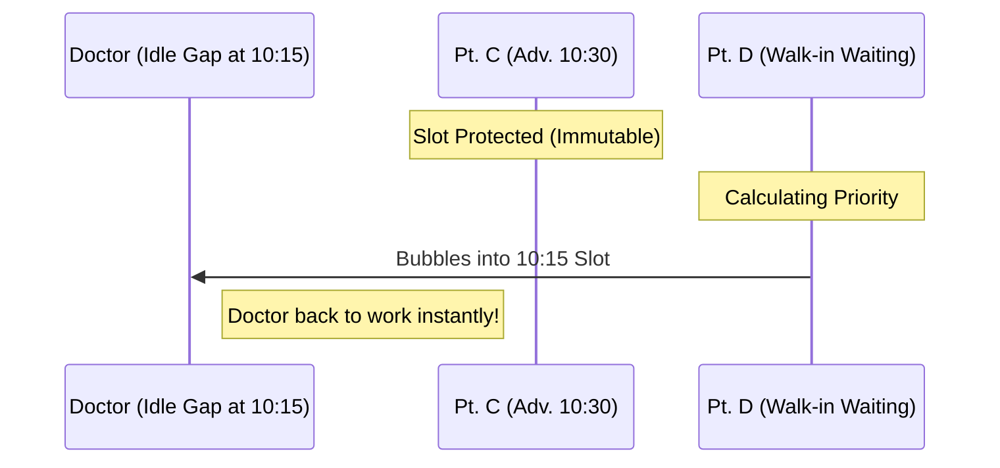

# 🛡️ THE KLOQO ARCHITECTURAL BIBLE
### *Official Record of the V2 Scheduling Infrastructure*

## Volume I: The Evolution (V1 vs V2)

In the beginning (V1), Kloqo was a simple queue management tool. In V2, it has become an industrial-grade **Orchestration Engine**.

### 📉 The Legacy System (V1)
*   **The "Shifter" Problem**: If a patient arrived early, the system would "shift" the entire queue. This broke promises made to patients who had booked specific times online.
*   **Concurrency Risk**: Multiple front-desk nurses could accidentally assign the same token number at the exact same split-second.
*   **Ghost Wait Times**: When a patient cancelled, their slot stayed "dead" until someone manually moved another patient into it.

### 🚀 The Hardened System (V2)
*   **Atomic Integrity**: We use a "Hardware Lock." No two patients can ever get the same token.
*   **Immutability**: Once an appointment is booked for 10:30 AM, that slot belongs to the patient. **It never shifts.**
*   **Active Bubbling**: The queue "heals" itself. If a gap opens up, the system automatically pulls a waiting walk-in forward to fill it.

---

### 📊 Integrity Comparison

---

## Volume II: Doctor-Specific Personalities

Kloqo V2 handles two distinct scheduling personalities: the **1:N Zipper** (Classic) and the **85/15 Buffer** (Advanced). 

> [!NOTE]
> **Autonomy Standard**: Distribution logic is configured **per doctor**, not per clinic. This allows a hybrid floor where a senior specialist (Advanced) and a general practitioner (Classic) coexist in the same facility.

| Feature | **Classic (The Zipper)** | **Advanced (The Buffer)** |
| :--- | :--- | :--- |
| **Logic** | **Rhythmic Interleaving** | **Clustered Priority** |
| **Experience** | Patients see a balanced mix of appointments and walk-ins. | Appointments are cleared first; Walk-ins are handled in bulk later. |
| **Capacity** | **100% Session Hard-Cap** (Strictly halts bookings once physical slots are filled, shifting control to Nurse-Only Force Book) | **85% A-Token Cap** (Reserved space for walk-ins) |
| **Best For** | High-volume hospitals with massive walk-in traffic. | High-end boutique clinics with primarily app bookings. |

### 🧩 The Pattern Layout
In a 60-minute hour with 15-min slots, here is how the slots are assigned:

*   **Classic Mode (1:3 Zipper)**:
    `[Appt] -> [Appt] -> [Appt] -> [WALK-IN]`
    *The walk-in is "zipped" into the middle of the rhythm.*

*   **Advanced Mode (85/15 Buffer)**:
    `[Appt] -> [Appt] -> [Appt] -> [Appt] -> [WALK-IN (Buffer)]`
    *Walk-ins are protected in a dedicated capacity window.*

---

## Volume III: The Zipper Bubble

This is the "Brain" of Kloqo. It ensures the doctor is never sitting idle, even if a patient doesn't show up.

### 🧠 How It Works
The system follows a strict **Immutability Firewall**. We never move an Advanced Booking (A-Token) forward across a gap, because moving their time without their consent is a bad user experience.

#### 🚑 PW-Tokens: Priority Triage
When the front desk flags a patient as **Priority** (e.g., elderly, pregnant, or emergency), the system bypasses standard buffer and zipper logic. It injects the **PW-Token** into the absolute next available physical gap. 
*   **Waiting Room Psychology**: These are visually rendered as **PW-105** to signal to other patients that a triage event has occurred, reducing friction over "queue jumping."

#### 🧼 The Zipper Bubble (Gap Filling)
1.  **A Vacancy Opens**: A patient at 10:15 AM is a "No-Show."
2.  **The Scan**: The system ignores the 10:30 AM Advanced patient (protecting their promise).
3.  **The Bubble**: The system identifies the next **Walk-in (W-Token)** waiting on the floor.
4.  **The Result**: That Walk-in is "bubbled" into the 10:15 AM gap.

### 📈 The Bubble Visual

---

## Volume IV: Real-World Scenarios

### 📍 Scenario A: The "Late" Appt Patient (Classic Mode)
*   **The Actor**: Patient Rahul has a 10:00 AM slot. He hasn't arrived by 10:15 AM.
*   **The Logic**: The **Sweep Engine** (Cron Job) triggers. 
*   **The Action**: Rahul is marked as "Skipped." The system instantly "bubbles" Patient Ajay (a walk-in who reached at 9:50 AM) into the doctor's room. 
*   **Result**: No time is wasted. Ajay is happy he got seen early. Rahul is notified to check-in again. **When Rahul finally arrives 45 minutes late, he triggers the Walk-in Downgrade Protocol.** He loses his A-Token privileges, is issued a standard W-Token, and must wait for the next natural gap.

### 📍 Scenario B: The "Peak Hour" Rush (Advanced Mode)
*   **The Actor**: Clinic has 5 online bookings at 11:00 AM. 
*   **The Logic**: The **85/15 Buffer** prevents the 6th person from booking online, keeping that slot open for a physical walk-in.
*   **The Action**: An elderly patient walks in without an app. Because of the **15% protection ratio**, a slot is ready for them even during the 11:00 AM peak.
*   **Result**: The clinic retains its premium "online" feel while remaining accessible to legacy walk-in patients.

---

## Volume V: Engineering Appendix

### 🧬 Technology Stack
*   **Database**: Firestore + Custom Cloud Transactions (Optimistic Concurrency).
*   **Real-time Layer**: **SSE (Server-Sent Events)** - Moving away from inefficient polling to push-based updates.
*   **Integrity Guard**: `FieldValue.increment()` ensures unique token numbers without race conditions.
*   **Resilience Hook**: A "Triple-Sync" system (SSE + Focus Refresh + 60s Polling) ensures the patient UI never goes out of sync.

### 🛠️ Key Files for Engineering
- **Bubbling Logic**: `backend/src/domain/services/QueueBubblingService.ts`
- **Slot Placement**: `backend/src/domain/services/WalkInPlacementService.ts`
- **Cleanup Engine**: `backend/src/application/ProcessGracePeriodsUseCase.ts`
- **SSE Registry**: `backend/src/domain/services/SSEService.ts`

---
> [!IMPORTANT]
> **Definitive Corporate Policy**: An A-Token is a sacred promise. A Walk-in is an opportunity for efficiency. The system mediates between the two using the **Zipper Bubble** logic.
